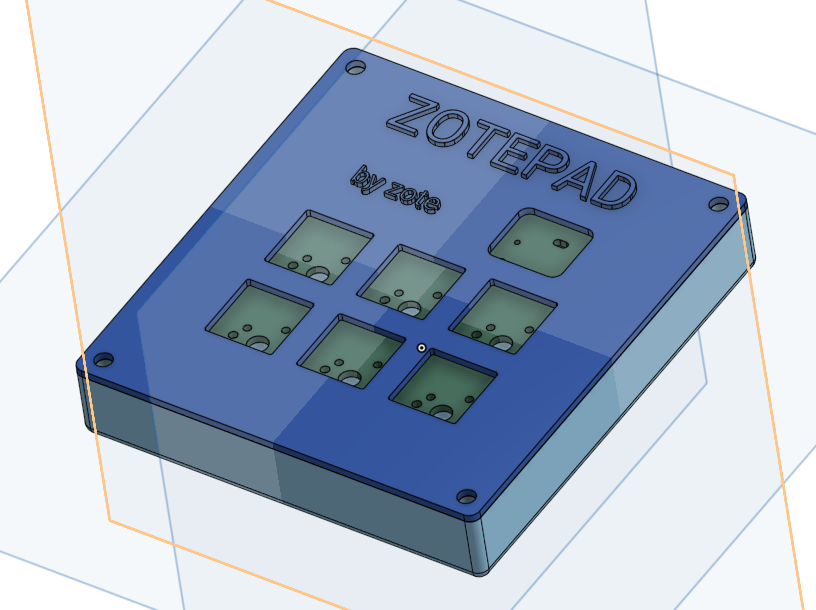
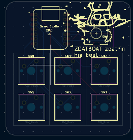
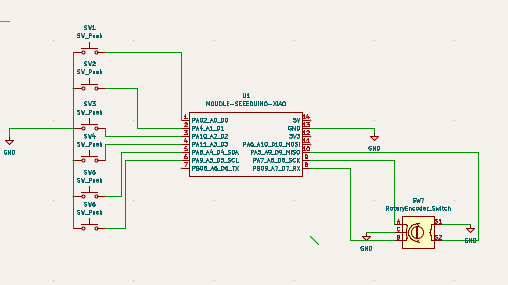

# ZOTEPAD

## About
This is my Zotepad it was named for Zote The Mighty from the hit indie Game 'Hollow Knight'. The Macropad has 6 keys and a rotary encoder. I designed the keys to be the battle keybinds for 'Undertale', so I can finally beat the boss Undyne the Undying. The case is a standard sandwich mount in which the PCB hangs of the top plate. The case is held together with heat set inserts and screws. I used KMK firmware to code the mapping of the keys. The case was made in onshape and the PCB has some silkcreen on it depicting the character 'Zote the Mighty'. I couldn't figure out how to hide the screws on the case; I could tell it was by flipping them upside down, but I didn't want to focus on that for my project. I found the hardest part of the project to be using CAD software for design, but after messing around a bit with the controls I figured out how to do it. I followed the guide for the begining making the PCB etc, but I stopped using it when I went back to the schematics to add my own features. 
## BOM
- 1x Zotepad Pcb
- 1x Bottom Case
- 1x Top Plate
- 6x MX Switches
- 1x Rotary Encoder EC11
- 1x XIAO RP2040
- 6x White Blank DSA keycaps
- 4x M3x16mm screws
- 4x M3x5mx4mm heatset inserts

This is my cad stuff:
[https://cad.onshape.com/documents/b8c557c7cba29d893ec7ee97/w/a27e70a122ce197b2fa20963/e/21f0d5da1cc23e3e0d761768?renderMode=0&uiState=6ac2b3909b3a99bbd460e99a](url)
